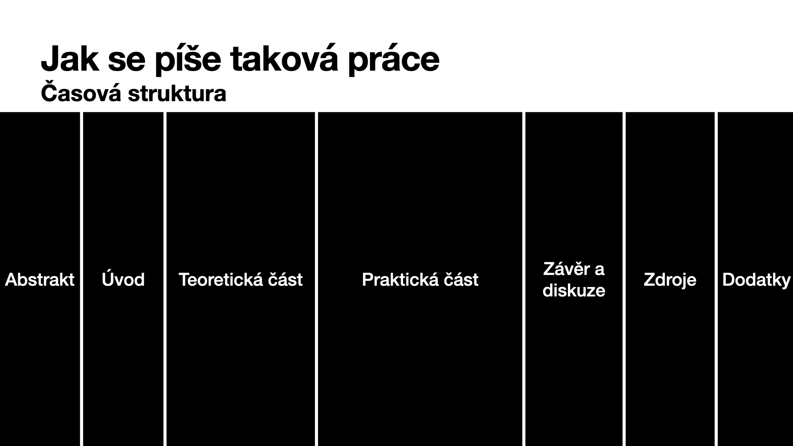
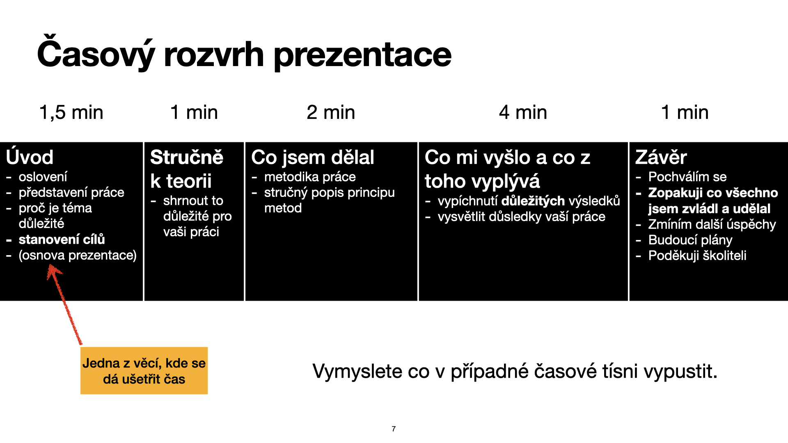

# Odpovědi na Vaše otázky

## Univerzální odpověď

__Na všechno máš školitele__

> Je to člověk, který by vás měl provázet prací a pomoct vám myšlenky vhodně formovat.

## Vážné odpovědi

- __Jak má SOČka vypadat formálně?__
- __Přesný obsah a struktura práce (aby to nebyla patlanice)__
__Jak zpracovat téma do práce?__

> Strukturu práce je možné vidět na následujícím slidu 
> 
> Přičemž konkrétní strukturu pro různé typy prací lze vidět níže.
> 
> Pro konkrétní předtavu doporučuji se podívat na [SOČky z loňských let](https://www.soc.cz/archiv-minulych-rocniku/), případně nahlédnout do šablon.

- __Jak dál pracovat s tématem (je snadné uhnout, nebo jít příliš do hloubky)__

> V práci by ses měl držet jedné linky. Tzn. _Nastudoval jsem si tuto teorii. V ní z tvrzení A plyne tvrzení B a pokud přidáme předpoklad C máme tvrzení D, které je klíčové pro můj experiment. Díky tomuto tvrzení jsem byl schopen provést tento experiment z něhož plyne závěr._

- __Citování?__
> Prakticky doporučuji se naučit používat Mendeley nebo Zotero. Odkaz na zdroj by měl vždy následovat po dokončení nějaké myšlenky, kterou přebíráš.

- __Okraje?__
> Není důležité, aby byly okraje nějaké konkrétní číslo. Nikdo tě neukamenuje, pokud buou o milimetr širší než v šabloně, důležité aby práce vypadala typograficky dobře.

- __Délka a obsah prezatace__

> Je zapotřebí se vejít do 10 min. Víc času člověk nedostane a výzkum se dá během této doby odporezentovat. V prezentaci se zaměř hlavně na výsledky a závěry tvé práce. Tu cestu k výsledkům zmiň jen okrajově. V prezentaci o prezentacích k tomu mám toto schéma.
> 

- __Uchopitelnost prezentace__

> _Doplním_

- __Praktická část? (píšu seminárku z dějepisu)__

> Asi idedální je poradit s tvým učitelem. Ale předpokládám, že hlavně budeš pátrat někde v archivech nebo jiných zdrojích a tvou prací by mělo být ukazovat dosud neznámá historická fakta.

- __Jak se něco naučit a jak aplikovat dovednosti?__

- __Co musí práce obsahovat (kritéria a podmínky)__
- __Plagiátorství, inspirace v jiných pracech.__