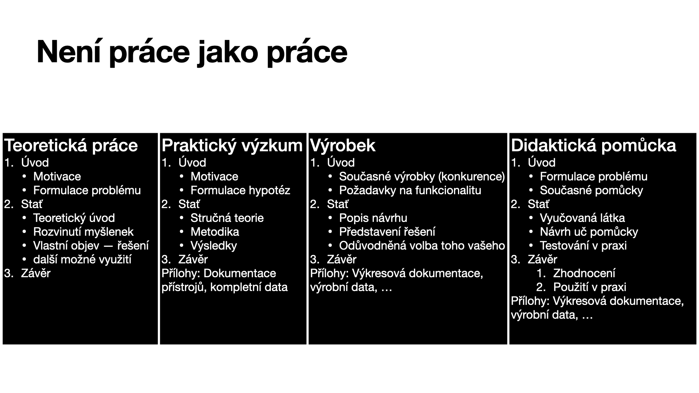

# Odpov캩di na Va코e ot치zky

## Univerz치ln칤 odpov캩캞

__Na v코echno m치코 코kolitele__

> Je to 캜lov캩k, kter칳 by v치s m캩l prov치zet prac칤 a pomoct v치m my코lenky vhodn캩 formovat.

## V치쬹칠 odpov캩di

- __Jak m치 SO캛ka vypadat form치ln캩?__
- __P콏esn칳 obsah a struktura pr치ce (aby to nebyla patlanice)__
__Jak zpracovat t칠ma do pr치ce?__

> Strukturu pr치ce je mo쬹칠 vid캩t na n치sleduj칤c칤m slidu 
> 
> P콏i캜em konkr칠tn칤 strukturu pro r콢zn칠 typy prac칤 lze vid캩t n칤쬰.
> 
> Pro konkr칠tn칤 p콏edtavu doporu캜uji se pod칤vat na [SO캛ky z lo켿sk칳ch let](https://www.soc.cz/archiv-minulych-rocniku/), p콏칤padn캩 nahl칠dnout do 코ablon.

- __Jak d치l pracovat s t칠matem (je snadn칠 uhnout, nebo j칤t p콏칤li코 do hloubky)__

> V pr치ci by ses m캩l dr쬰t jedn칠 linky. Tzn. _Nastudoval jsem si tuto teorii. V n칤 z tvrzen칤 A plyne tvrzen칤 B a pokud p콏id치me p콏edpoklad C m치me tvrzen칤 D, kter칠 je kl칤캜ov칠 pro m콢j experiment. D칤ky tomuto tvrzen칤 jsem byl schopen prov칠st tento experiment z n캩ho plyne z치v캩r._

- __Citov치n칤?__
> Prakticky doporu캜uji se nau캜it pou쮂셨at Mendeley nebo Zotero. Odkaz na zdroj by m캩l v쬯y n치sledovat po dokon캜en칤 n캩jak칠 my코lenky, kterou p콏eb칤r치코.

- __Okraje?__
> Nen칤 d콢le쬴t칠, aby byly okraje n캩jak칠 konkr칠tn칤 캜칤slo. Nikdo t캩 neukamenuje, pokud buou o milimetr 코ir코칤 ne v 코ablon캩, d콢le쬴t칠 aby pr치ce vypadala typograficky dob콏e.

- __D칠lka a obsah prezatace__

> Je zapot콏eb칤 se vej칤t do 10 min. V칤c 캜asu 캜lov캩k nedostane a v칳zkum se d치 b캩hem t칠to doby odporezentovat. V prezentaci se zam캩콏 hlavn캩 na v칳sledky a z치v캩ry tv칠 pr치ce. Tu cestu k v칳sledk콢m zmi켿 jen okrajov캩. V prezentaci o prezentac칤ch k tomu m치m toto sch칠ma.
> 

- __Uchopitelnost prezentace__

> _Dopln칤m_

- __Praktick치 캜치st? (p칤코u semin치rku z d캩jepisu)__

> Asi ided치ln칤 je poradit s tv칳m u캜itelem. Ale p콏edpokl치d치m, 쬰 hlavn캩 bude코 p치trat n캩kde v archivech nebo jin칳ch zdroj칤ch a tvou prac칤 by m캩lo b칳t ukazovat dosud nezn치m치 historick치 fakta.

- __Plagi치torstv칤, inspirace v jin칳ch pracech.__
> To, 쬰 p콏eb칤r치코 my코lenky z jin칳ch zdroj콢 je v po콏치dku stejn캩 tak i inspirace. Je v코ak d콢le쬴t칠, aby jsi 콏치dn캩 uvedl v코echny zdroje, aby bylo mo쬹칠 vid캩t, co jsi ud캩lal ty. Pro porotce je to kl칤캜ov칠, jeliko posuzuj칤 to kolik jsi toho s치m ud캩lal. Pr치v캩 objevit n캩co nov칠ho a p콏ij칤t s n캩캜칤m nov칳m je to co vyhr치v치. Proto, aby sis ov캩콏il(a) jestli tv치 pr치ce nen칤 plagi치t doporu캜uji ji p콏ed odevzd치n칤m prohnat n캩kter칳m z softwar콢 jako je t콏eba [Odevzdej.cz](https://odevzdej.cz).

- __Co mus칤 pr치ce obsahovat (krit칠ria a podm칤nky)__

> Co by m캩la pr치ce obsahovat je uvedeno v칳코e. Tzn. n캩co z teorie, kter치 je kl칤캜ov치, pro tv콢j objev, to na 캜em jsi pracoval a co jsi objevil a n치sledn캩, co z toho plyne. U pr치ce je odporu캜en칠, aby m캩la zhruba 20 - 30 stran bez p콏칤loh (z치vis칤 taky na na tom kolik tam m치코 obr치zk콢).

- __Jak se n캩co nau캜it a jak aplikovat dovednosti?__
> Pr치ce na projektu, ze kter칠ho n치sledn캩 bude코 ps치t sout캩쬹칤 pr치ci je bezesporu jedn칤m z nejlep코칤ch zp콢sob콢, jak se neu캜it n캩캜emu nov칠mu. R치d 콏칤k치m, 쬰 pr치v캩 takto se nejsn치ze pod칤v치코 n캩kter칠mu oboru "pod pokli캜ku". U캜en칤 se nov칳m v캩cem p콏irozen캩 p콏ich치z칤 p콏i zpracov치v치n칤 projektu. A aplikace dovednost칤? Uvid칤코, 쬰 캜asto se bude코 u캜it t칤m, 쬰 n캩co rovnou za캜n캩코 d캩lat. Jak se anglicky 콏칤k치 _learning by doing_. Tak쬰 o tuto str치nku bych nem캩l starost. 游뗵
