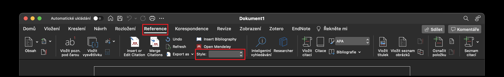
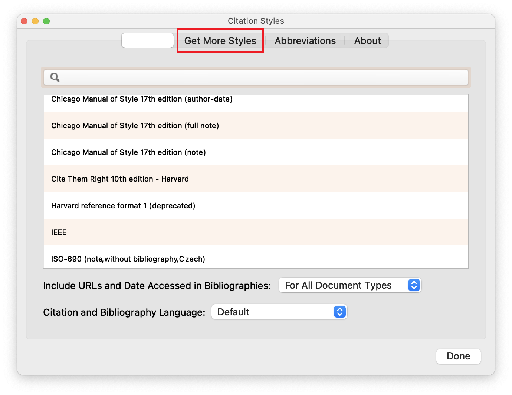
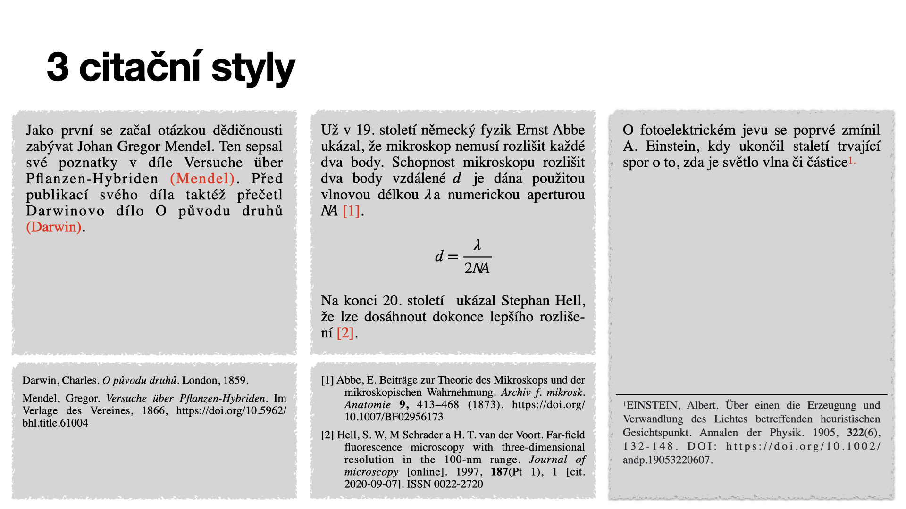

# Ahoj, ahoj, ahoj 🙋🏻‍♂️

vítám tě v repozitáři, kde nalezneš prezentace ze semináře k SOČ, který se konal od 2. do 4. října 2022 v Brně. 

## Co tu nejdeš?

TODO: dopsat obsah

### Prezentace
No hlavně __prezentace__ a níže v dokumentu i pár tipů. Prezentace budu přidávat postupně a to v PDFku, Powerpointu a formátu pro Keynote, ve kterém byla prezentace původně vytvořena. Proto, když prezentaci otevřeš v powerpointu, tak může být rozbitá. 

- Jak psát práci [PDF](./psani_prace.pdf)
- Prezentace SOČ [PDF](./prezentace.pdf)

### Odpovědi na otázky

Dále na [této podstránce](./otazky/readme.md) nalezneš odpovědi na otázky, které vám byli nejasné na dřívějších seminářích. Záměrně ponechávám i pro další generace.

### Šablony SOČ
- [LaTeXová šablona](https://github.com/Kubiczek36/SOC_sablona)
- [Šablona vytvořená JCMM](./sablona_pro_sockare.docx) - Tato šablona je velmi povedená obsahuje velké množství komentářů, které vám mohou pomoct.
- [oficiální šablona SOČ](https://www.soc.cz/dokumenty/sablona_SOC.docx)

## Jak si nainstalovat Mendeley 
```diff
- STARŠÍ NYNÍ DOPORUČUJI POUŽÍVAT ZOTERO!
```


O mendeley jsem na kurzu mluvil, je to velmi užitečný nástroj při spravování odborných zdrojů. [__Stáhneš ho zde__](https://www.mendeley.com/download-reference-manager/).

Taktéž je dobré si nainstalovat [__doplněk do prohlížeče__](https://www.mendeley.com/reference-management/web-importer). A pomocí tohoto návodu také doplněk Pro MS Word, na to je [tento návod](https://www.mendeley.com/guides/using-citation-editor). Vše najdeš na kartě `preference`.

Ve Wordu je zapotřebí nastavit správný citační styl. Proto na kartě `reference` vyber možnost `style`.



Pak si na kartě `Get More Styles` vyber 
- `ISO-690 (author-date, Czech)` pro možnost autor-datum (Harvardský styl), 
- `ISO-690 (note, without bibliography, Czech)` pro možnost citace formou poznámek pod čarou,
- `ISO-690 (numeric, brackets, Czech)` pro možnost číslování.

> Pro připoměnutí citačních stylů:
> 

Samotný odkaz do textu (např `[1]`), přidáš pomocí `Insert or edit citation`. Seznam zdrojů vyvoříš pomocí `Insert Bibliography`.

A kdyby něco, tak se ozývejte :) 